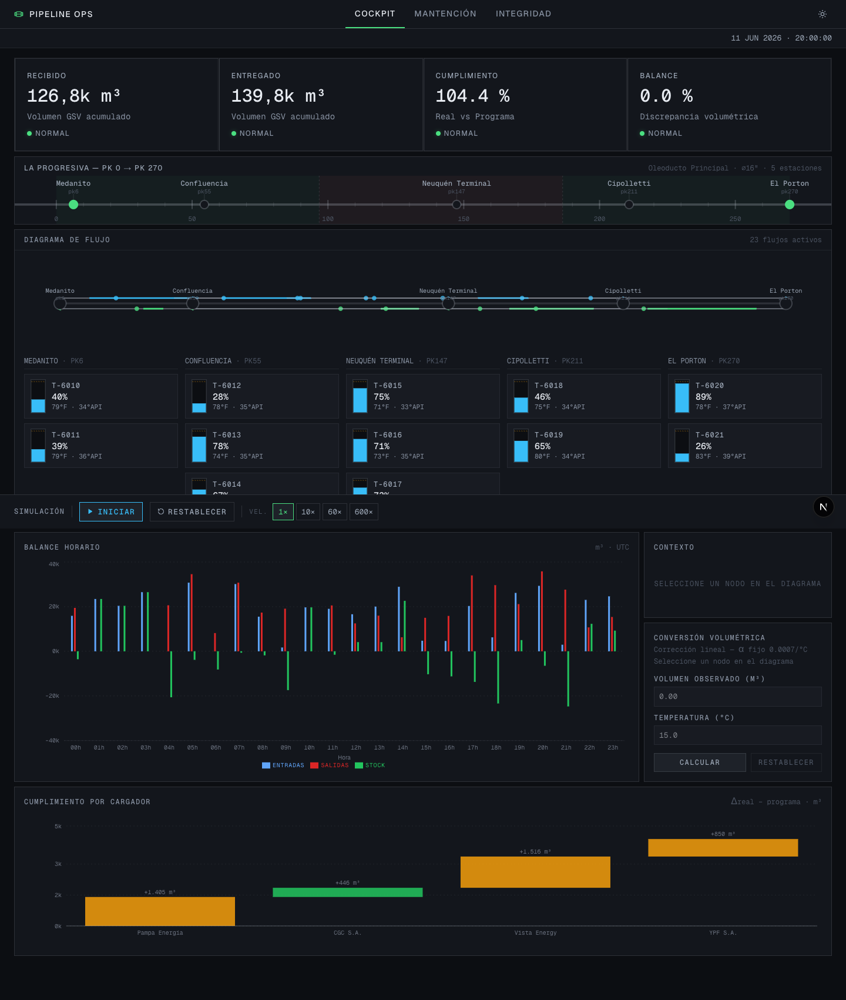
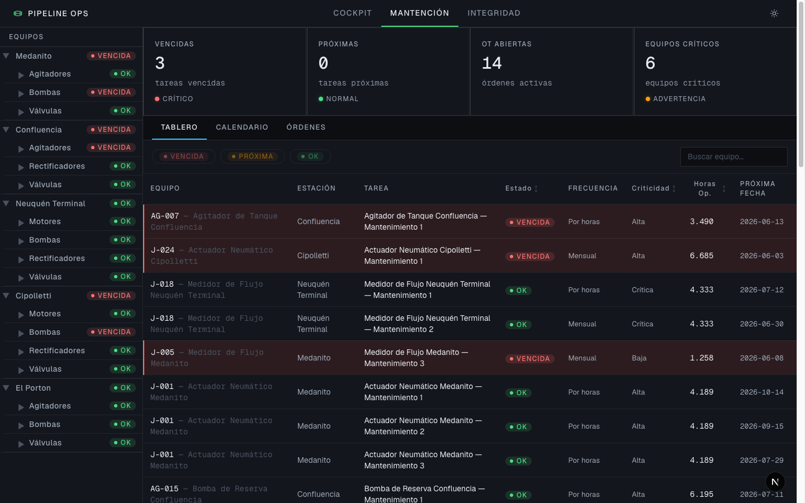
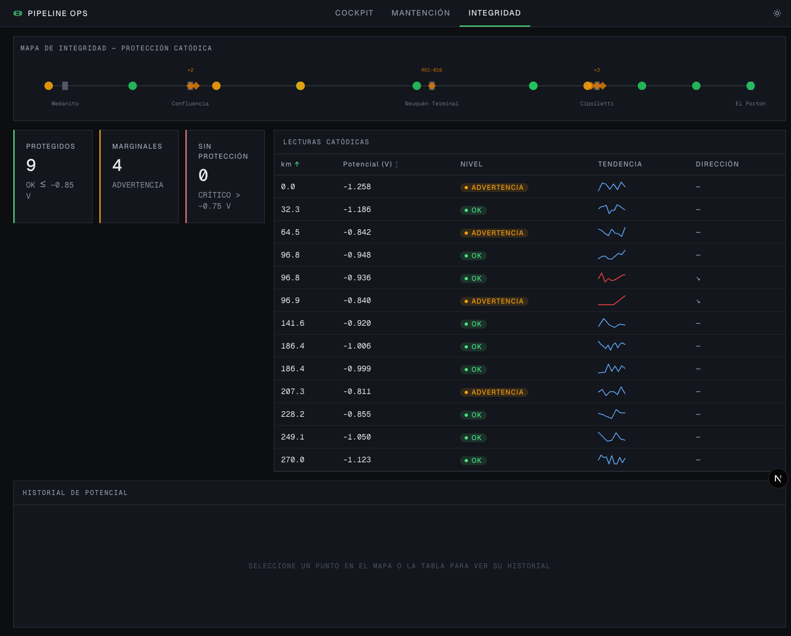
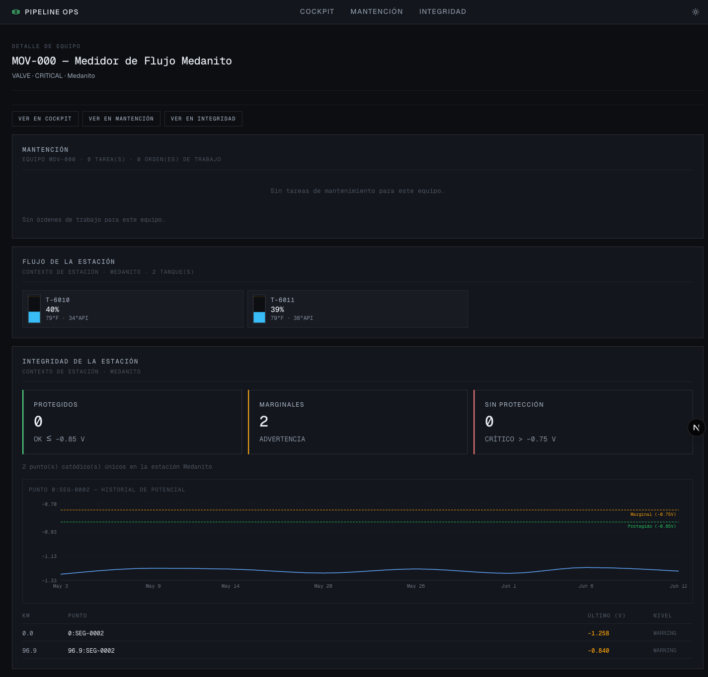

# Pipeline Operations Platform

Plataforma web de operación de un oleoducto que unifica tres dominios en una sola aplicación: **monitoreo de flujo en tiempo cuasi-real (Cockpit)**, **gestión de mantenimiento (CMMS)** e **integridad y protección catódica del trazado**. Proyecto de portafolio orientado al sector energía/operaciones industriales, con foco en frontend, lógica de dominio y arquitectura.

> Los datos son 100 % sintéticos, generados por código con seed fija. No se usa ningún dato real de operadores o clientes.

---

## Módulos

### Cockpit — Flujo de crudo en tiempo cuasi-real

Simulación continua del llenado y vaciado de estanques según caudal activo. Diagrama SVG con tuberías direccionales (downstream/upstream), tarjetas de estanque agrupadas por estación, indicadores de flujo activo (▲ IN / ▼ OUT), controles de velocidad (1×, 10×, 60×, 600×) y KPIs de cumplimiento real vs. programa vs. presupuesto.



<!-- TODO: GIF de la simulación en vivo -->

---

### Mantención — CMMS

Árbol jerárquico de estaciones y equipos (bombas, agitadores, válvulas, rectificadores), tablero de tareas con priorización por criticidad, calendario mensual de mantenimiento preventivo y lista de órdenes de trabajo con estado y progreso.



---

### Integridad — Mapa de protección catódica

Mapa lineal del trazado por kilómetro (pk) con estaciones, rectificadores y puntos de lectura coloreados por nivel de alerta (OK / WARNING / CRITICAL). Tabla de lecturas con sparklines de tendencia y panel de serie histórica con líneas de umbral (−0.850 V / −0.750 V criterio NACE).



---

### Detalle de equipo — Vista agregada cross-módulo (Fase 4)

Página `/equipment/[id]` que consolida los tres ángulos de un mismo equipo: sección de mantenimiento (tareas, estado, horas acumuladas), contexto de estación en el cockpit (estanques asociados) e integridad (lecturas catódicas de la estación). Incluye enlaces de navegación cruzada hacia cada módulo con el foco ya aplicado.



---

## Qué resuelve / contexto de dominio

Un oleoducto mueve crudo entre estaciones de bombeo a lo largo de cientos de kilómetros. En cada estación hay estanques que acumulan el producto, bombas que lo impulsan y equipos que requieren mantenimiento. A lo largo del trazado hay rectificadores de protección catódica que protegen la tubería de la corrosión.

Esta plataforma modela ese mundo completo:

- **Flujo y balance volumétrico**: cuánto crudo entró, cuánto salió, cuánto queda en stock. Las conversiones se hacen a condición estándar (15°C y 60°F) usando gravedad API y un factor de corrección térmica (coeficiente α = 0.0007 /°C, aproximación lineal del estándar ASTM D1250).
- **Mantenimiento preventivo**: cada equipo tiene un plan con tareas por calendario (diaria → anual) o por horas de operación acumuladas. La lógica calcula cuándo vence la próxima intervención y prioriza por criticidad del equipo.
- **Protección catódica**: cada punto del ducto tiene lecturas de potencial eléctrico (mV). Bajo −0.850 V: protegido. Entre −0.850 V y −0.750 V: advertencia. Sobre −0.750 V: riesgo de corrosión. Se detecta además si las últimas tres lecturas siguen una tendencia de degradación sostenida.

El diferenciador del proyecto frente a un portafolio genérico es el **conocimiento de dominio**: reglas físicas reales, algoritmos de programación industrial y criterios de integridad de la industria (NACE), no solo componentes de UI.

---

## Stack técnico

| Capa | Tecnología | Versión |
|------|-----------|---------|
| Framework | Next.js (App Router) | 16.2.7 |
| UI library | React | 19.2.4 |
| Lenguaje | TypeScript (strict mode) | ^5 |
| Estilos | Tailwind CSS | ^4 |
| Gráficas | Recharts | ^3.8.1 |
| Estado global | Zustand | ^5.0.14 |
| Testing | Vitest + jsdom | ^4.1.8 |
| Datos sintéticos | @faker-js/faker (solo build) | ^10.4.0 |
| Package manager | pnpm | — |

---

## Arquitectura

### Estructura de carpetas

```
src/
├── app/                    # Rutas Next.js (App Router)
│   ├── cockpit/            # Módulo 1: simulación de flujo
│   ├── maintenance/        # Módulo 2: CMMS
│   ├── integrity/          # Módulo 3: mapa de integridad
│   ├── equipment/[id]/     # Página agregada cross-módulo
│   ├── layout.tsx          # Layout global: nav, tema
│   └── globals.css         # Tokens de diseño (Tailwind @theme)
│
├── lib/                    # Lógica de dominio pura — sin React
│   ├── domain/             # Tipos del núcleo compartido (types.ts, constants.ts)
│   ├── data/               # Generador de datos sintéticos + seed.json + validador
│   ├── volumetrics/        # Conversiones 15°C↔60°F, balance volumétrico, compliance
│   ├── simulation/         # Simulación de caudal y llenado/vaciado
│   ├── maintenance/        # Scheduling: next due, estado de tarea, priorización
│   ├── integrity/          # Evaluación de umbrales catódicos, detección de tendencia
│   ├── focus/              # resolveEntity + buildFocusHref (navegación cruzada)
│   └── kpi/                # Derivaciones de KPIs por módulo
│
├── components/             # Componentes React
│   ├── layout/             # Nav, ThemeToggle
│   ├── cockpit/            # FlowDiagram, TankGauge, SimControls, BalancePanel
│   ├── maintenance/        # EquipmentTree, MaintenanceBoard, Calendar, WorkOrders
│   ├── integrity/          # PipelineMap, ReadingsTable, SparklineCell, ReadingDetail
│   ├── shared/             # CrossNavLinks (navegación cruzada entre módulos)
│   └── charts/             # TimeSeriesChart, Sparkline
│
├── store/                  # Estado global (Zustand)
│   ├── worldStore.ts       # Mundo sintético cargado + flag loaded
│   └── selectionStore.ts   # Entidad actualmente enfocada
│
└── hooks/                  # Hooks React
    ├── useSimulation.ts    # Loop requestAnimationFrame del cockpit
    ├── useFocusSync.ts     # Sincronización URL ↔ selectionStore
    └── useWorld.ts         # Acceso tipado al worldStore
```

**Principio clave**: todo lo de `src/lib/` son funciones puras testeables que no saben que existe React. Las conversiones físicas, los algoritmos de scheduling y la detección de anomalías se prueban de forma aislada con Vitest; los componentes consumen esa lógica a través de hooks.

---

### Decisiones de arquitectura

#### 1. `lib/` hexagonal: lógica pura separada del framework

Toda la lógica de dominio (conversiones, balance, scheduling, thresholds, simulación) vive en `src/lib/` como TypeScript puro, sin dependencias de React ni Next.js. Las stores/hooks/componentes son adaptadores delgados sobre ese núcleo.

**Por qué**: habilita Strict TDD sobre la lógica más crítica sin DOM. Los revisores técnicos pueden leer y evaluar los algoritmos sin entender la UI. Los 456 tests corren en < 4 segundos.

---

#### 2. Mundo congelado con seed fija — faker nunca entra al cliente

`generateWorld()` usa un PRNG determinístico (mulberry32) con seed fija. El resultado se pre-genera con `pnpm generate:seed` y se guarda en `src/lib/data/seed.json`. La app importa el JSON estático; faker/tsx solo se usan en el script de build y nunca entran al bundle del cliente.

**Por qué**: la demo es estable (misma seed → mismo mundo) y la carga inicial es un JSON sin procesamiento. El validador `validateWorld()` verifica integridad referencial, niveles de estanque, orden de pk y balances sobre el mundo antes de guardarlo.

---

#### 3. `?focus=<entityId>` — URL como fuente de verdad para el foco cruzado

La entidad enfocada se persiste como `?focus=<entityId>` en la URL. El hook `useFocusSync` montado en cada página sincroniza bidireccionalmente la URL con `selectionStore`: la URL es autoritativa al montar (permite hard-refresh y deep links), el store es autoritativo en sesión activa. Un `lastSyncedRef` (valor, no booleano) actúa como loop guard.

**Por qué**: deep links funcionales sin Zustand `persist`. Compartir un link de un equipo abre la misma vista con el mismo foco. El tipo de entidad se resuelve desde el mundo, no se incluye en la URL (la URL solo guarda el id).

---

#### 4. `resolveEntity()` — puente universal entre dominios

`src/lib/focus/resolveEntity.ts` es una función pura que, dado `(world, id)`, devuelve `{ id, type, stationId } | null`. La resolución es por pertenencia a colecciones (no por parsing de prefijos). Devuelve `null` en lugar de lanzar excepciones.

**Por qué**: **Station es el único FK universal cross-dominio**. No existen links directos equipo→estanque ni estanque→lecturas. Todo puente entre módulos pasa por `stationId`. `resolveEntity` es el punto donde ese contrato se codifica explícitamente.

---

#### 5. `/equipment/[id]` — página de agregación cross-módulo

La página de detalle de equipo consolida datos de los tres módulos usando selectores existentes, sin duplicar datos en el store. Las tres secciones (Maintenance, Cockpit context, Integrity) se componen desde `lib/` y cada una maneja su propio estado vacío (obligatorio en la sección de integridad, donde `stationId` puede ser null en CathodicReading).

**Por qué**: demuestra que la plataforma es una sola cosa, no tres demos. Un equipo que aparece en el diagrama de flujo es el mismo que tiene un plan de mantenimiento y vive en un pk del mapa de integridad.

---

#### 6. SVG sizing recipe: viewBox + aspectRatio + maxWidth + mx-auto

Para SVG dibujados a mano (FlowDiagram, PipelineMap), el patrón canónico es: `viewBox` declarado + `preserveAspectRatio="xMidYMid meet"` + CSS `aspect-ratio` en el contenedor + `max-width` + `mx-auto`. Recharts usa `ResponsiveContainer` dentro de un padre con altura fija. Los dos patrones no se mezclan.

**Por qué**: soluciona los bugs de distorsión y espacio muerto que aparecen cuando se mezclan estrategias de sizing. Aprendido en Fase 1, documentado como ADR-7 y reutilizado en Fase 3 (PipelineMap).

---

## Datos sintéticos

El mundo completo (estaciones, estanques, equipos, planes de mantenimiento, movimientos, lecturas catódicas, telemetría) es generado por código usando una **seed fija** (`scripts/generate-seed.ts`). No hay backend, no hay base de datos, no hay datos reales.

Esto es deliberado:

- **Estabilidad de demo**: misma seed → mismo mundo en cada build. Los tests de dominio no dependen del tiempo real.
- **Consistencia cross-módulo**: el mismo equipo que aparece en el cockpit tiene tareas de mantenimiento y lecturas de integridad coherentes porque todo salió del mismo generador.
- **Demostración técnica**: la capacidad de generar datos sintéticos realistas (con conversiones físicas correctas, balances que cuadran, y series catódicas con degradación inyectada) es parte de lo que el proyecto demuestra.

El validador `validateWorld()` en `src/lib/data/validate.ts` verifica integridad referencial, rangos de nivel de estanques, orden de pk a lo largo del trazado y coherencia de balances antes de que el JSON se incluya en el repositorio.

---

## Calidad y testing

```
Tests   456 passed (456)
Files    25 test files
Runner  Vitest 4.1.8
```

La suite cubre:

| Área | Ejemplos de casos testeados |
|------|-----------------------------|
| Conversiones volumétricas | Ida y vuelta 15°C↔60°F; SG de 10°API = 1.0; sin cambio a T_obs = T_ref |
| Balance de estanque | Stock final, diferencia, porcentaje; niveles OK/WARNING/CRITICAL |
| Simulación de flujo | Caudal constante, tope en capacidad, no negativos |
| Scheduling de mantenimiento | nextDueDate por calendario; nextDueAtHours por horas; estado VENCIDA/PRÓXIMA/OK; score de priorización |
| Umbrales catódicos | Criterio −0.850/−0.750 V; detección de tendencia degradante en últimas 3 lecturas |
| resolveEntity | Resolución por tipo; stationId como bridge; null en id desconocido |
| validateWorld | Integridad referencial del mundo generado; fallo intencional al corromper un id |

Toda la lógica de dominio se desarrolló con **Strict TDD (RED → GREEN → REFACTOR)**. TypeScript en modo estricto sin excepciones. Build limpio (`pnpm build` sin errores ni warnings).

---

## Cómo correrlo

**Requisitos**: Node.js ≥ 20, pnpm.

```bash
# Instalar dependencias
pnpm install

# Desarrollo (localhost:3000)
pnpm dev

# Tests
pnpm test

# Build de producción
pnpm build

# (Opcional) Regenerar el mundo sintético con nueva seed
pnpm generate:seed
```

---

## Estructura de docs

```
docs/
├── PROJECT_INFO.md     # Visión, modelo de datos y stack (documento de diseño original)
├── BACKLOG.md          # Backlog por fase (F0 a F5), con criterios de aceptación
├── DOMAIN_RULES.md     # Fórmulas, reglas y constantes del dominio
├── DOMAIN_MODEL.md     # Modelo de entidades y relaciones
└── screenshots/
    ├── cockpit.png
    ├── maintenance.png
    ├── integrity.png
    └── equipment.png
```

---

## Estado del proyecto

| Fase | Descripción | Estado |
|------|-------------|--------|
| Fase 0 — Fundaciones | Tipos, generador, lógica de dominio, Zustand stores, diseño base | Completa |
| Fase 1 — Cockpit | Diagrama SVG, simulación de caudal, estanques animados, KPIs, balance | Completa |
| Fase 2 — CMMS | Árbol de equipos, scheduling, calendario, órdenes de trabajo | Completa |
| Fase 3 — Integrity Map | Mapa lineal, evaluación catódica, sparklines, serie histórica | Completa |
| Fase 4 — Integración | `?focus=` URL, `resolveEntity`, `/equipment/[id]`, `CrossNavLinks` | Completa |
| Fase 5 — Pulido | UI polish, README de portafolio, deploy en Vercel | En curso |
